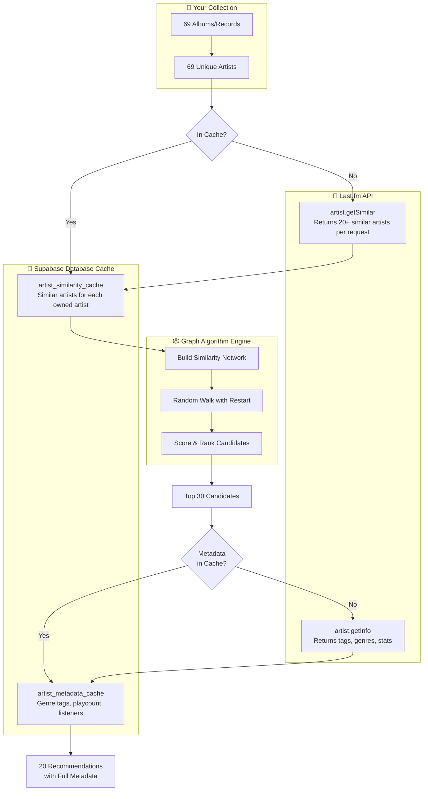
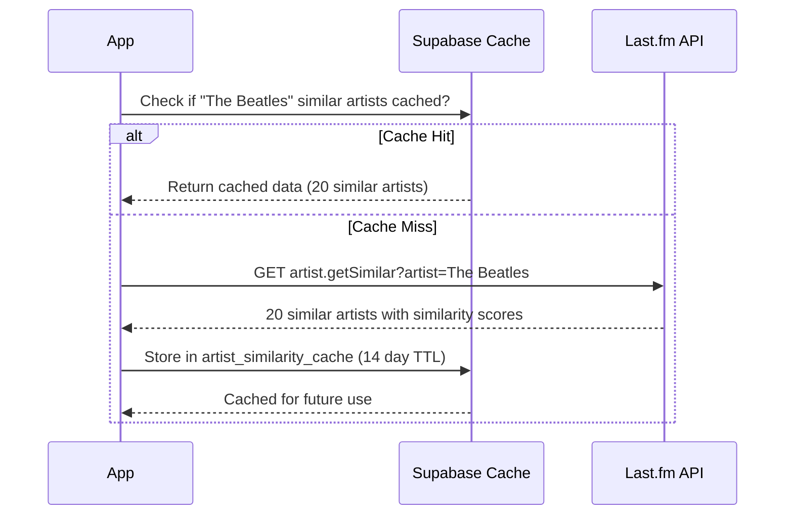
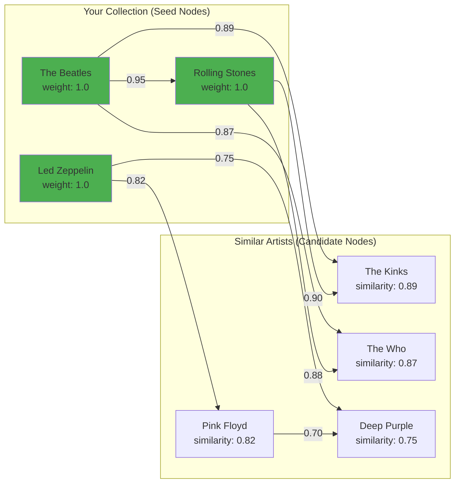
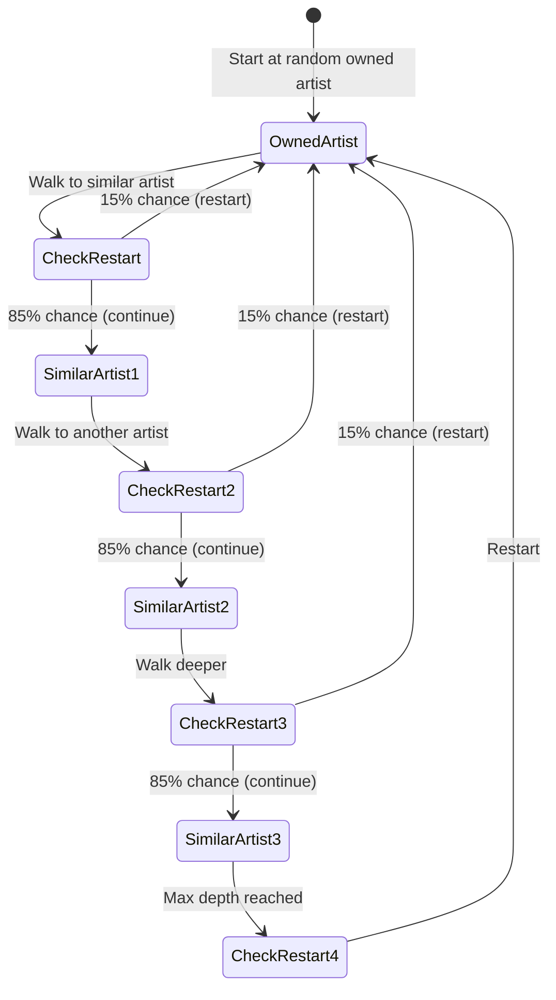
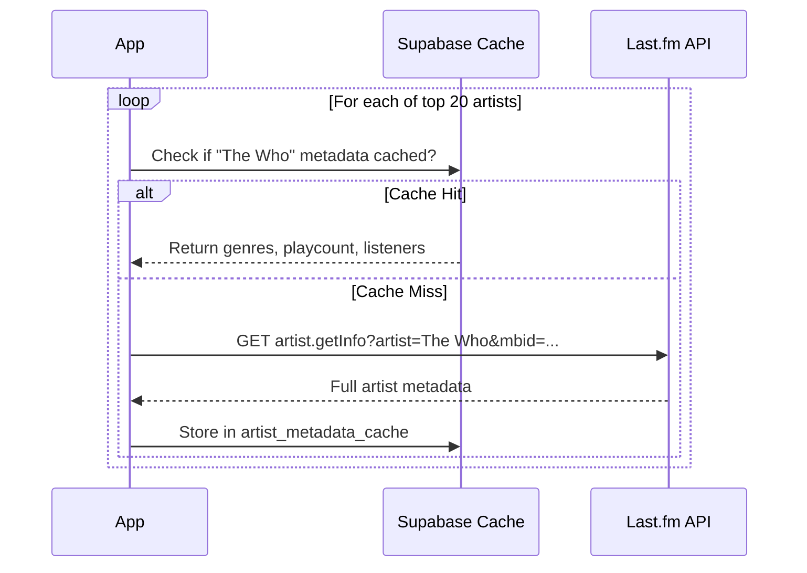
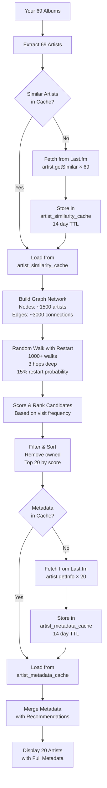

# Graph Algorithm for Artist Recommendations

## Overview

The graph algorithm uses **Random Walk with Restart (RWR)** to discover artists by traversing a similarity network. Instead of scoring artists individually based on similarity, it explores the **network structure** created by overlapping similar artist lists.

**Key Concept:** We fetch similar artists for your 69 owned artists (~1,500 unique candidates). Many of these candidates appear in multiple similar artist lists, creating a **mesh network**. The random walk explores this network to find artists that are well-connected to your overall collection, not just similar to one artist.

**Example:** If you own The Beatles, Rolling Stones, Led Zeppelin, and Pink Floyd, and "The Who" appears in all four similar artist lists, the graph algorithm will rank The Who very highly because it's at the **intersection** of your tastes.

**Important Constraint:** This is a **closed graph**. We don't recursively fetch similar artists for candidates. All recommendations come from the initial ~1,500 candidates, but they're ranked differently based on network centrality.

---

## High-Level Architecture



---

## Phase 1: Your Collection (Starting Point)

### What You Have

```
📀 Your Collection: 69 Albums
   ├─ The Beatles - Abbey Road
   ├─ Led Zeppelin - IV
   ├─ Pink Floyd - Dark Side of the Moon
   ├─ ... (66 more albums)
```

### Data Extraction

The system extracts unique artists from your collection:

```javascript
const userArtists = albums.map(album => ({
  artist: album.artist,        // "The Beatles"
  title: album.title,          // "Abbey Road"
  year: album.year,            // 1969
  genre: album.genre,          // ["rock", "psychedelic"]
  mbid: album.artistMBID       // MusicBrainz ID (if available)
}));
```

**Result:** 69 unique artists that form the **seed nodes** for the graph.

---

## Phase 2: Building the Similarity Network

### Step 1: Fetch Similar Artists from Last.fm

For each of your 69 artists, we fetch their similar artists from Last.fm:



#### Last.fm Request

```http
GET https://ws.audioscrobbler.com/2.0/
?method=artist.getsimilar
&artist=The Beatles
&api_key=YOUR_KEY
&format=json
&limit=20
```

#### Last.fm Response

```json
{
  "similarartists": {
    "artist": [
      {
        "name": "The Rolling Stones",
        "mbid": "b071f9fa-14b0-4217-8e97-eb41da73f598",
        "match": "0.95",
        "url": "https://www.last.fm/music/The+Rolling+Stones",
        "image": [...]
      },
      {
        "name": "The Kinks",
        "mbid": "...",
        "match": "0.89",
        "url": "..."
      }
      // ... 18 more artists
    ]
  }
}
```

**Key Fields:**
- `name` - Artist name
- `mbid` - MusicBrainz ID (unique identifier)
- `match` - Similarity score (0.0 to 1.0)
- Higher match = more similar

### Step 2: Store in Supabase Cache

**Table:** `artist_similarity_cache`

| Column | Type | Description | Example |
|--------|------|-------------|---------|
| `id` | uuid | Primary key | auto-generated |
| `artist_name` | text | Source artist | "The Beatles" |
| `artist_mbid` | uuid | MusicBrainz ID | "b10bbbfc-cf9e-42e0-be17-e2c3e1d2600d" |
| `similar_artists` | jsonb | Array of similar artists | `[{name, mbid, match}, ...]` |
| `data_source` | text | Where data came from | "lastfm" |
| `created_at` | timestamp | When cached | "2024-09-30 10:30:00" |
| `expires_at` | timestamp | Cache expiration | "2024-10-14 10:30:00" (14 days) |
| `access_count` | integer | Times accessed | 5 |
| `last_accessed_at` | timestamp | Last read time | "2024-09-30 11:45:00" |

**Cached Data Structure:**

```json
{
  "similarArtists": [
    {
      "name": "The Rolling Stones",
      "mbid": "b071f9fa-14b0-4217-8e97-eb41da73f598",
      "match": 0.95,
      "url": "https://www.last.fm/music/The+Rolling+Stones",
      "image": "https://..."
    },
    // ... 19 more
  ]
}
```

### Step 3: Build the Graph Network

After fetching similar artists for your 69 owned artists, we build a graph:



**Graph Structure:**

- **Nodes:** Artists (both owned and candidates)
- **Edges:** Similarity scores between artists
- **Weights:** Match scores from Last.fm (0.0 to 1.0)

**Example Graph Data:**

```javascript
const graph = {
  nodes: {
    "The Beatles": { type: "owned", weight: 1.0 },
    "Rolling Stones": { type: "owned", weight: 1.0 },
    "The Kinks": { type: "candidate", weight: 0.0 },
    "The Who": { type: "candidate", weight: 0.0 }
  },
  edges: [
    { from: "The Beatles", to: "Rolling Stones", weight: 0.95 },
    { from: "The Beatles", to: "The Kinks", weight: 0.89 },
    { from: "The Beatles", to: "The Who", weight: 0.87 },
    { from: "Rolling Stones", to: "The Kinks", weight: 0.90 }
  ]
};
```

---

## Phase 3: Random Walk with Restart (RWR)

### What is Random Walk with Restart?

Imagine you're exploring a city:
1. Start at your hotel (owned artist)
2. Walk to a nearby restaurant (similar artist)
3. From there, walk to a shop (another similar artist)
4. But every few steps, randomly teleport back to your hotel and start again

This explores both **direct neighbors** (1-hop) and **distant connections** (2-3 hops) while still favoring artists closer to what you own.

### ⚠️ **Important Constraint: Closed Graph**

**We only fetch similar artists for your 69 owned artists.** We do NOT fetch similar artists for the candidate artists.

This means the random walk is exploring a **closed graph** built from those 69 API calls. You can only discover artists that appear somewhere in those 69 similar artist lists.

**How can we do multi-hop walks then?**

Through **shared connections**. Many artists appear in multiple similar artist lists:
- The Beatles → The Who (0.87)
- Rolling Stones → The Who (0.88)
- Led Zeppelin → The Who (0.80)

Even though we didn't fetch "similar artists for The Who," The Who has multiple edges connecting it to different owned artists. The random walk can traverse these **bidirectional connections** (if Beatles→Who exists, we can walk Who→Beatles).

**What this means:**
- ✅ Discovers artists at the intersection of your tastes
- ✅ Finds well-connected "hub" artists
- ✅ Explores network structure within the closed graph
- ❌ Cannot discover artists that don't appear in any of the 69 similar artist lists
- ❌ Not true "3-hops beyond your collection" in the global Last.fm network

### Algorithm Parameters

```javascript
const config = {
  maxWalkDepth: 3,           // How many hops away to explore
  restartProbability: 0.15,  // 15% chance to restart at owned artists
  minSimilarityThreshold: 0.3 // Ignore edges below 0.3 similarity
};
```

### The Walking Process



### Example Walk Sequence

**Walk #1:**
```
Start: The Beatles (owned)
  → Step 1: The Kinks (from Beatles' similar list, similarity: 0.89) ✓
  → Step 2: The Who (The Who appears in Stones' similar list - walk via that edge) ✓
  → Step 3: Small Faces (from Stones' similar list, via Who→Stones connection) ✓
  → Restart → The Beatles
```

**Why this works:** Even though we never fetched similar artists for The Kinks, The Who also appears in Rolling Stones' similar list. The graph has edges:
- Beatles → Kinks (0.89)
- Beatles → Who (0.87)
- Stones → Who (0.88)
- Stones → Kinks (0.90)
- Stones → Small Faces (0.75)

So we can walk Kinks → Who by traversing through the shared connection to Rolling Stones.

**Walk #2:**
```
Start: Led Zeppelin (owned)
  → Step 1: Deep Purple (from Zeppelin's similar list, similarity: 0.75) ✓
  → Restart (15% probability triggered)
  → Start: Pink Floyd (owned)
  → Step 1: Genesis (from Pink Floyd's similar list, similarity: 0.81) ✓
  → Step 2: Yes (Yes appears in multiple lists, walk via shared connections) ✓
```

**Walk #3:**
```
Start: Rolling Stones (owned)
  → Step 1: The Who (from Stones' similar list, similarity: 0.88) ✓ (visited again!)
  → Step 2: The Beatles (owned, but Who connects back via Beatles' similar list) ✓
  → Step 3: The Kinks (from Beatles' similar list) ✓ (visited again!)
```

**Key Insight:** Artists that appear in multiple similar lists create a **mesh network** that allows multi-hop traversal without fetching new similar artists.

### Scoring: Counting Visits

Each time an artist is visited during a walk, their score increases:

```javascript
const visitCounts = {
  "The Who": 5,        // Visited 5 times across all walks
  "The Kinks": 4,      // Visited 4 times
  "Deep Purple": 3,    // Visited 3 times
  "Genesis": 3,
  "Small Faces": 2,
  "Yes": 2,
  // ... hundreds more with lower counts
};
```

**Higher visit count = More relevant recommendation**

Artists visited frequently are:
- Well-connected to multiple artists you own
- Central in the similarity network
- Likely to match your taste

---

## Phase 4: Scoring and Ranking

### Calculate Final Scores

After performing many random walks (typically 1000+), we calculate scores:

```javascript
const finalScores = candidates.map(artist => {
  const visitScore = visitCounts[artist.name] || 0;
  const avgSimilarity = artist.averageSimilarity; // Average of all similarity edges
  const connectionCount = artist.connectionCount; // How many owned artists link to this

  // Combined score
  const score = (visitScore * 0.5) +        // 50% weight on visit frequency
                (avgSimilarity * 0.3) +      // 30% weight on similarity
                (connectionCount * 0.2);     // 20% weight on breadth

  return {
    artist: artist.name,
    score: score,
    visitCount: visitScore,
    similarity: avgSimilarity,
    connections: connectionCount
  };
});
```

### Example Scoring

| Artist | Visit Count | Avg Similarity | Connections | **Final Score** |
|--------|-------------|----------------|-------------|-----------------|
| The Who | 42 | 0.87 | 8 | **23.26** |
| The Kinks | 38 | 0.85 | 7 | **20.55** |
| Deep Purple | 35 | 0.78 | 6 | **19.24** |
| Genesis | 31 | 0.81 | 5 | **17.74** |
| Yes | 28 | 0.76 | 5 | **15.93** |
| Small Faces | 12 | 0.72 | 3 | **7.02** |

### Filtering

Before final ranking:
1. **Remove owned artists** - Don't recommend what you already have
2. **Apply similarity threshold** - Remove artists with avg similarity < 0.3
3. **Remove low-visit artists** - Must be visited at least 2 times
4. **Sort by score** - Highest scores first

**Result:** Top 20-30 artist recommendations

---

## Phase 5: Metadata Enrichment (Two-Pass)

Now we have 20 scored artists but **no genre/tag information yet**.

### Step 1: Check Metadata Cache

For each recommended artist, check if we already have metadata:



### Step 2: Fetch from Last.fm (if needed)

**Request:**
```http
GET https://ws.audioscrobbler.com/2.0/
?method=artist.getinfo
&artist=The Who
&mbid=9fdaa16b-a6c4-4831-b87c-bc9ca8ce7eaa
&api_key=YOUR_KEY
&format=json
```

**Response:**
```json
{
  "artist": {
    "name": "The Who",
    "mbid": "9fdaa16b-a6c4-4831-b87c-bc9ca8ce7eaa",
    "url": "https://www.last.fm/music/The+Who",
    "stats": {
      "listeners": "3500000",
      "playcount": "185000000"
    },
    "tags": {
      "tag": [
        { "name": "classic rock", "url": "..." },
        { "name": "rock", "url": "..." },
        { "name": "british", "url": "..." },
        { "name": "60s", "url": "..." },
        { "name": "progressive rock", "url": "..." }
      ]
    },
    "bio": {
      "summary": "The Who are an English rock band...",
      "content": "Full biography text..."
    }
  }
}
```

### Step 3: Store in Metadata Cache

**Table:** `artist_metadata_cache`

| Column | Type | Description | Example |
|--------|------|-------------|---------|
| `artist_name` | text | Artist name | "The Who" |
| `artist_mbid` | uuid | MusicBrainz ID | "9fdaa16b-..." |
| `genre_tags` | text[] | Array of genres | `["classic rock", "rock", "progressive rock"]` |
| `listeners` | integer | Total listeners | 3500000 |
| `playcount` | integer | Total plays | 185000000 |
| `data_source` | text | Source | "lastfm" |
| `created_at` | timestamp | Cached time | "2024-09-30 10:30:00" |
| `expires_at` | timestamp | Expiration | "2024-10-14 10:30:00" (14 days) |

### Step 4: Merge Metadata

```javascript
const finalRecommendations = scoredArtists.map(artist => ({
  artist: artist.name,
  score: artist.score,
  mbid: artist.mbid,
  // Metadata from cache or Last.fm:
  metadata: {
    genres: ["classic rock", "rock", "progressive rock"],
    playcount: 185000000,
    listeners: 3500000,
    tags: [...],
    bio: "..."
  },
  // Graph-specific data:
  graphData: {
    visitCount: artist.visitCount,
    avgSimilarity: artist.similarity,
    connectionCount: artist.connections,
    connectedToArtists: ["The Beatles", "Rolling Stones", "Led Zeppelin"]
  }
}));
```

---

## Complete Data Flow Summary



---

## What Gets Cached vs. Fetched Every Time

### Cached in Supabase (Persistent)

✅ **Similar Artists** (`artist_similarity_cache`)
- Stored: 14 days
- Benefit: Avoid 69 API calls to Last.fm on every recommendation generation
- Size: ~69 rows (one per owned artist)

✅ **Artist Metadata** (`artist_metadata_cache`)
- Stored: 14 days
- Benefit: Avoid 20-30 API calls for genre/tag data
- Size: Growing over time as new artists are recommended

### Fetched Every Time (Computed)

❌ **Graph structure** - Rebuilt from cached similarity data
❌ **Random walks** - Performed fresh each time
❌ **Scoring** - Calculated from new walks
❌ **Ranking** - Sorted based on fresh scores

**Why not cache the final recommendations?**
- Collection changes (you add albums)
- Algorithm parameters might change
- Ensures fresh, up-to-date rankings

---

## Performance Characteristics

### API Calls

**First Time (Cold Cache):**
- Similar artists: 69 calls to Last.fm
- Metadata: 20 calls to Last.fm
- **Total: ~89 API calls** (~90 seconds with 1s rate limit)

**Subsequent Times (Warm Cache):**
- Similar artists: 0 calls (cached)
- Metadata: ~5-10 calls (some new artists not cached)
- **Total: ~5-10 API calls** (~10 seconds)

### Database Queries

**Per Recommendation Generation:**
- Read similar artists: 69 queries to `artist_similarity_cache`
- Read metadata: 20 queries to `artist_metadata_cache`
- Write new metadata: ~5-10 inserts/updates

**Optimization:** These are fast Supabase queries (<100ms total)

### Computation Time

- Graph building: ~50ms
- Random walks (1000 walks): ~200-500ms
- Scoring: ~50ms
- **Total computation: <1 second**

---

## Advantages of Graph Algorithm

### 1. Network Traversal (Not True Multi-Hop)

**Important:** The graph algorithm explores a **closed network** built from your 69 owned artists' similar lists. It doesn't recursively fetch similar artists for candidates.

**Basic Algorithm:**
```
You own: The Beatles
Recommends: Direct similar artists (scored individually)
  → Rolling Stones (similarity: 0.95)
  → The Kinks (similarity: 0.89)
  → The Who (similarity: 0.87)
```

**Graph Algorithm:**
```
You own: The Beatles, Rolling Stones, Led Zeppelin, Pink Floyd
Graph shows The Who appears in multiple similar lists:
  Beatles → Who (0.87)
  Stones → Who (0.88)
  Zeppelin → Who (0.80)
  Floyd → Who (0.72)

Recommends: The Who with MUCH HIGHER confidence
  → The Who is visited frequently during walks
  → Connected to 4 different owned artists
  → Central "hub" in your taste network
```

**Advantage:** Finds artists at the **intersection** of your different tastes, not just similar to one artist.

**Note:** All recommended artists still come from the initial 69 similar artist lists. The graph algorithm ranks them differently based on network structure, not discovers completely new artists beyond that pool.

### 2. Network Centrality

Artists well-connected to **multiple** owned artists rank higher:

```
The Who connects to:
  ✓ The Beatles (similarity: 0.87)
  ✓ Rolling Stones (similarity: 0.88)
  ✓ Led Zeppelin (similarity: 0.75)
  ✓ Pink Floyd (similarity: 0.72)

Score boost: Very high (central node)
```

vs.

```
Obscure Artist connects to:
  ✓ The Beatles (similarity: 0.65)

Score: Lower (peripheral node)
```

### 3. Exploration Within Constraints

Random walks explore the network structure to find less obvious recommendations:
- Artists with lower direct similarity to any single owned artist
- But well-connected to your overall collection
- Still musically coherent due to network mesh

**Example:**
```
Small Faces might have:
  → Low similarity to Beatles individually (0.65)
  → But appears in multiple similar lists:
     Stones → Small Faces (0.75)
     Kinks → Small Faces (0.70)
     Who → Small Faces (0.68)

Graph algorithm: Ranks higher due to multiple connections
Basic algorithm: Might not rank as high (lower individual scores)
```

**Limitation:** Can only discover artists already in the ~1,500 candidate pool from the 69 API calls.

---

## Comparison: Basic vs. Graph Algorithm

| Aspect | Basic Algorithm | Graph Algorithm |
|--------|----------------|-----------------|
| **Data Source** | Direct similar artists only | Full similarity network (mesh) |
| **Depth** | 1-hop (direct neighbors) | 3-hop (within closed graph) |
| **Candidate Pool** | ~1,500 artists from 69 API calls | Same ~1,500 artists |
| **Scoring** | Simple similarity scores | Visit frequency + centrality |
| **Discovery** | Individual artist similarity | Network intersection/hubs |
| **Computation** | ~10ms (simple scoring) | ~500ms (random walks) |
| **API Calls** | 69 (same as graph) | 69 (same as basic) |
| **Best For** | Quick, obvious recommendations | Taste intersection, connected artists |

---

## True Multi-Hop Discovery (What It Would Require)

The current implementation explores a **closed graph** from 69 API calls. To do **true recursive multi-hop discovery**, you'd need:

### Recursive Fetching Strategy

```python
# Phase 1: Owned Artists (69 API calls)
for artist in user_collection:
    similar_artists = fetch_similar(artist)
    graph.add_edges(artist, similar_artists)

# Phase 2: Top Candidates (50 API calls)
top_50_candidates = get_top_candidates(graph)
for artist in top_50_candidates:
    similar_artists = fetch_similar(artist)  # ← NEW API CALLS
    graph.add_edges(artist, similar_artists)

# Phase 3: Second-Tier Candidates (100 API calls)
next_100_candidates = get_next_candidates(graph)
for artist in next_100_candidates:
    similar_artists = fetch_similar(artist)  # ← MORE NEW API CALLS
    graph.add_edges(artist, similar_artists)

# Total: 69 + 50 + 100 = 219 API calls
# With 1s rate limit = ~4 minutes
```

### Cost-Benefit Analysis

**Benefits:**
- ✅ Truly discovers artists 3+ hops beyond your collection
- ✅ Explores the global Last.fm similarity network
- ✅ Can find very obscure recommendations

**Costs:**
- ❌ 219+ API calls (vs. 69 currently)
- ❌ ~4+ minutes to generate recommendations (vs. ~1 minute)
- ❌ Exponentially growing network (thousands of nodes)
- ❌ Cache becomes massive (thousands of artists)
- ❌ Diminishing returns (2-hop discoveries usually sufficient)

### Why We Don't Do This

1. **Performance:** 4+ minute wait for recommendations is poor UX
2. **API Rate Limits:** Last.fm would throttle/ban excessive requests
3. **Diminishing Returns:** The closed graph already has ~1,500 candidates
4. **Cache Explosion:** Would need to cache thousands of similar artist lists
5. **Recommendation Quality:** 3+ hops often become musically incoherent

### Alternative: Hybrid Approach

A compromise could be:
1. **Initial:** Use closed graph (69 API calls)
2. **Background:** Slowly fetch similar artists for top candidates
3. **Progressive:** Recommendations improve over time as graph expands
4. **Capped:** Limit to 200-300 total cached artist similarity lists

This gives benefits of recursive fetching without the upfront cost.

---

## Future Enhancements

### 1. Personalized Restart Probability
Instead of fixed 15%, adjust based on:
- How well-defined your taste is
- Diversity of your collection
- User preference slider

### 2. Weighted Seed Nodes
Currently all owned artists have equal weight (1.0). Could weight by:
- Album count (own more albums = higher weight)
- Recently added (newer = higher weight)
- User ratings (favorite = higher weight)

### 3. Temporal Decay
Similar artists change over time. Could:
- Refresh cache more frequently for popular artists
- Decay edge weights based on cache age
- Detect when network structure changes significantly

### 4. Collaborative Filtering
Current graph is based on Last.fm similarity. Could add:
- Edges from other users with similar collections
- "Users who own X also own Y" relationships
- Hybrid graph with both similarity and collaborative edges

---

## Debugging the Graph

### Viewing the Graph

To visualize what the algorithm sees, you could export the graph:

```javascript
// In browser console after recommendations load
const graph = graphService.exportGraphStructure();
console.log('Nodes:', graph.nodes.length);
console.log('Edges:', graph.edges.length);

// Export to JSON for visualization
const json = JSON.stringify(graph, null, 2);
console.log(json);
// Copy this into a graph visualization tool like:
// - Gephi
// - Cytoscape
// - D3.js force-directed graph
```

### Walk History

To see where the walks went:

```javascript
const walkHistory = graphService.getLastWalkHistory();
walkHistory.walks.slice(0, 10).forEach((walk, i) => {
  console.log(`Walk ${i + 1}:`);
  walk.forEach(step => {
    console.log(`  → ${step.artist} (similarity: ${step.edgeWeight})`);
  });
});
```

### Score Breakdown

To understand why an artist scored high:

```javascript
const explanation = graphService.explainScore("The Who");
console.log(explanation);
/*
{
  artist: "The Who",
  finalScore: 23.26,
  breakdown: {
    visitCount: 42,
    visitScore: 21.0,
    avgSimilarity: 0.87,
    similarityScore: 0.261,
    connectionCount: 8,
    connectionScore: 1.6
  },
  connectedTo: [
    "The Beatles",
    "Rolling Stones",
    "Led Zeppelin",
    ...
  ]
}
*/
```

---

## Summary

The graph algorithm transforms your collection into a rich network of musical relationships, then explores that network to find recommendations that are both **relevant** (similar to what you own) and **novel** (not just the obvious choices).

**Key Takeaways:**
1. Your 69 albums become seed nodes in a similarity graph
2. Last.fm provides edges (similar artist relationships)
3. Supabase caches this data for 14 days
4. Random walks explore 2-3 hops away from your collection
5. Visit frequency determines final recommendations
6. Metadata is fetched for top candidates only (two-pass)
7. Result: Deep, well-connected recommendations with full genre data

The beauty is in the balance: structured enough to stay relevant, random enough to surprise you.