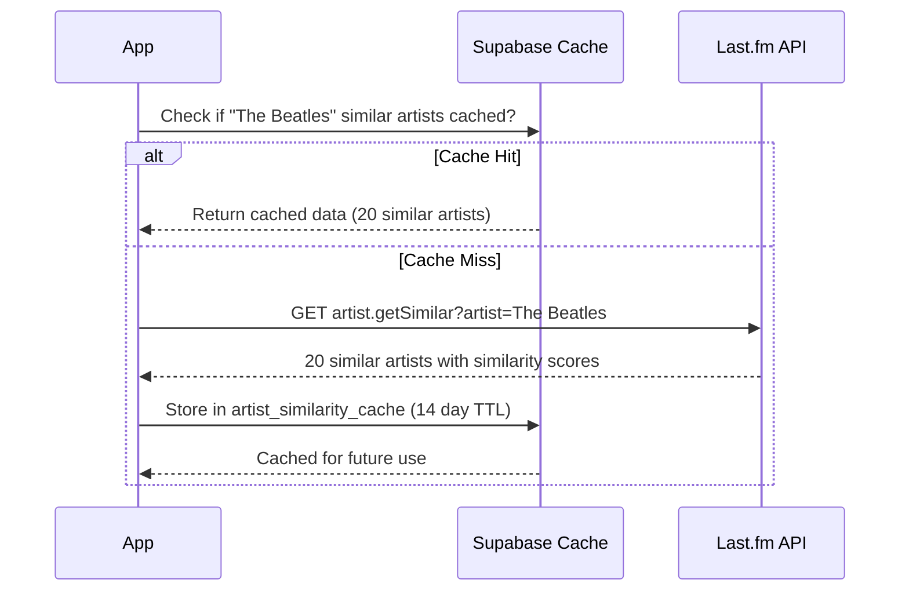
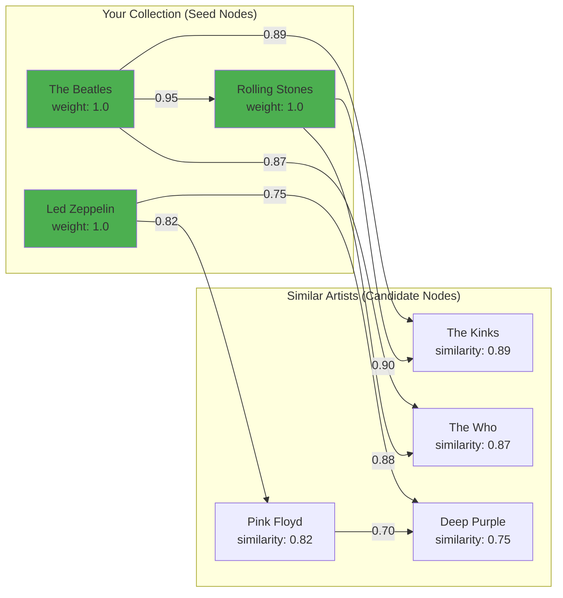
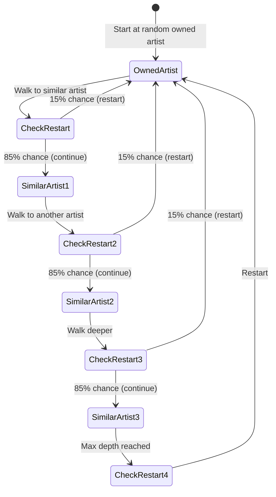
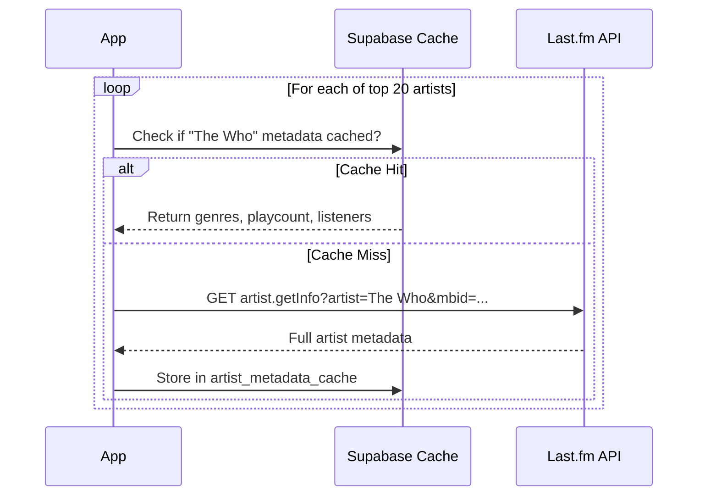

# Graph Algorithm for Artist Recommendations

## Overview

The graph algorithm uses **Random Walk with Restart (RWR)** to discover artists by traversing a similarity network. Instead of just looking at direct similar artists, it explores multi-hop connections to find deeper recommendations.

Think of it like this: If you own The Beatles, it doesn't just recommend The Rolling Stones. It walks through the network (Beatles → Stones → Led Zeppelin → Deep Purple → Uriah Heep) to find artists 2-3 steps away that you might not have discovered otherwise.

---

## High-Level Architecture

```mermaid
flowchart TB
    subgraph UserCollection["👤 Your Collection"]
        Albums[69 Albums/Records]
        Artists[69 Unique Artists]
    end

    subgraph LastFM["🎵 Last.fm API"]
        SimilarAPI[artist.getSimilar<br/>Returns 20+ similar artists per request]
        ArtistInfoAPI[artist.getInfo<br/>Returns tags, genres, stats]
    end

    subgraph SupabaseCache["💾 Supabase Database Cache"]
        SimilarCache[artist_similarity_cache<br/>Similar artists for each owned artist]
        MetadataCache[artist_metadata_cache<br/>Genre tags, playcount, listeners]
    end

    subgraph GraphEngine["🕸️ Graph Algorithm Engine"]
        BuildGraph[Build Similarity Network]
        RandomWalk[Random Walk with Restart]
        ScoreNodes[Score & Rank Candidates]
    end

    Albums --> Artists
    Artists --> CheckCache1{In Cache?}
    CheckCache1 -->|No| SimilarAPI
    CheckCache1 -->|Yes| SimilarCache
    SimilarAPI --> SimilarCache
    SimilarCache --> BuildGraph

    BuildGraph --> RandomWalk
    RandomWalk --> ScoreNodes
    ScoreNodes --> TopCandidates[Top 30 Candidates]

    TopCandidates --> CheckCache2{Metadata<br/>in Cache?}
    CheckCache2 -->|No| ArtistInfoAPI
    CheckCache2 -->|Yes| MetadataCache
    ArtistInfoAPI --> MetadataCache
    MetadataCache --> FinalRecs[20 Recommendations<br/>with Full Metadata]
```



---

## Phase 1: Your Collection (Starting Point)

### What You Have

```
📀 Your Collection: 69 Albums
   ├─ The Beatles - Abbey Road
   ├─ Led Zeppelin - IV
   ├─ Pink Floyd - Dark Side of the Moon
   ├─ ... (66 more albums)
```

### Data Extraction

The system extracts unique artists from your collection:

```javascript
const userArtists = albums.map(album => ({
  artist: album.artist,        // "The Beatles"
  title: album.title,          // "Abbey Road"
  year: album.year,            // 1969
  genre: album.genre,          // ["rock", "psychedelic"]
  mbid: album.artistMBID       // MusicBrainz ID (if available)
}));
```

**Result:** 69 unique artists that form the **seed nodes** for the graph.

---

## Phase 2: Building the Similarity Network

### Step 1: Fetch Similar Artists from Last.fm

For each of your 69 artists, we fetch their similar artists from Last.fm:



#### Last.fm Request

```http
GET https://ws.audioscrobbler.com/2.0/
?method=artist.getsimilar
&artist=The Beatles
&api_key=YOUR_KEY
&format=json
&limit=20
```

#### Last.fm Response

```json
{
  "similarartists": {
    "artist": [
      {
        "name": "The Rolling Stones",
        "mbid": "b071f9fa-14b0-4217-8e97-eb41da73f598",
        "match": "0.95",
        "url": "https://www.last.fm/music/The+Rolling+Stones",
        "image": [...]
      },
      {
        "name": "The Kinks",
        "mbid": "...",
        "match": "0.89",
        "url": "..."
      }
      // ... 18 more artists
    ]
  }
}
```

**Key Fields:**
- `name` - Artist name
- `mbid` - MusicBrainz ID (unique identifier)
- `match` - Similarity score (0.0 to 1.0)
- Higher match = more similar

### Step 2: Store in Supabase Cache

**Table:** `artist_similarity_cache`

| Column | Type | Description | Example |
|--------|------|-------------|---------|
| `id` | uuid | Primary key | auto-generated |
| `artist_name` | text | Source artist | "The Beatles" |
| `artist_mbid` | uuid | MusicBrainz ID | "b10bbbfc-cf9e-42e0-be17-e2c3e1d2600d" |
| `similar_artists` | jsonb | Array of similar artists | `[{name, mbid, match}, ...]` |
| `data_source` | text | Where data came from | "lastfm" |
| `created_at` | timestamp | When cached | "2024-09-30 10:30:00" |
| `expires_at` | timestamp | Cache expiration | "2024-10-14 10:30:00" (14 days) |
| `access_count` | integer | Times accessed | 5 |
| `last_accessed_at` | timestamp | Last read time | "2024-09-30 11:45:00" |

**Cached Data Structure:**

```json
{
  "similarArtists": [
    {
      "name": "The Rolling Stones",
      "mbid": "b071f9fa-14b0-4217-8e97-eb41da73f598",
      "match": 0.95,
      "url": "https://www.last.fm/music/The+Rolling+Stones",
      "image": "https://..."
    },
    // ... 19 more
  ]
}
```

### Step 3: Build the Graph Network

After fetching similar artists for your 69 owned artists, we build a graph:



**Graph Structure:**

- **Nodes:** Artists (both owned and candidates)
- **Edges:** Similarity scores between artists
- **Weights:** Match scores from Last.fm (0.0 to 1.0)

**Example Graph Data:**

```javascript
const graph = {
  nodes: {
    "The Beatles": { type: "owned", weight: 1.0 },
    "Rolling Stones": { type: "owned", weight: 1.0 },
    "The Kinks": { type: "candidate", weight: 0.0 },
    "The Who": { type: "candidate", weight: 0.0 }
  },
  edges: [
    { from: "The Beatles", to: "Rolling Stones", weight: 0.95 },
    { from: "The Beatles", to: "The Kinks", weight: 0.89 },
    { from: "The Beatles", to: "The Who", weight: 0.87 },
    { from: "Rolling Stones", to: "The Kinks", weight: 0.90 }
  ]
};
```

---

## Phase 3: Random Walk with Restart (RWR)

### What is Random Walk with Restart?

Imagine you're exploring a city:
1. Start at your hotel (owned artist)
2. Walk to a nearby restaurant (similar artist)
3. From there, walk to a shop (another similar artist)
4. But every few steps, randomly teleport back to your hotel and start again

This explores both **direct neighbors** (1-hop) and **distant connections** (2-3 hops) while still favoring artists closer to what you own.

### Algorithm Parameters

```javascript
const config = {
  maxWalkDepth: 3,           // How many hops away to explore
  restartProbability: 0.15,  // 15% chance to restart at owned artists
  minSimilarityThreshold: 0.3 // Ignore edges below 0.3 similarity
};
```

### The Walking Process



### Example Walk Sequence

**Walk #1:**
```
Start: The Beatles (owned)
  → Step 1: The Kinks (similarity: 0.89) ✓
  → Step 2: The Who (similarity: 0.87) ✓
  → Step 3: Small Faces (similarity: 0.72) ✓
  → Restart → The Beatles
```

**Walk #2:**
```
Start: Led Zeppelin (owned)
  → Step 1: Deep Purple (similarity: 0.75) ✓
  → Restart (15% probability triggered)
  → Start: Pink Floyd (owned)
  → Step 1: Genesis (similarity: 0.81) ✓
  → Step 2: Yes (similarity: 0.76) ✓
```

**Walk #3:**
```
Start: Rolling Stones (owned)
  → Step 1: The Who (similarity: 0.88) ✓ (visited again!)
  → Step 2: The Kinks (similarity: 0.85) ✓ (visited again!)
```

### Scoring: Counting Visits

Each time an artist is visited during a walk, their score increases:

```javascript
const visitCounts = {
  "The Who": 5,        // Visited 5 times across all walks
  "The Kinks": 4,      // Visited 4 times
  "Deep Purple": 3,    // Visited 3 times
  "Genesis": 3,
  "Small Faces": 2,
  "Yes": 2,
  // ... hundreds more with lower counts
};
```

**Higher visit count = More relevant recommendation**

Artists visited frequently are:
- Well-connected to multiple artists you own
- Central in the similarity network
- Likely to match your taste

---

## Phase 4: Scoring and Ranking

### Calculate Final Scores

After performing many random walks (typically 1000+), we calculate scores:

```javascript
const finalScores = candidates.map(artist => {
  const visitScore = visitCounts[artist.name] || 0;
  const avgSimilarity = artist.averageSimilarity; // Average of all similarity edges
  const connectionCount = artist.connectionCount; // How many owned artists link to this

  // Combined score
  const score = (visitScore * 0.5) +        // 50% weight on visit frequency
                (avgSimilarity * 0.3) +      // 30% weight on similarity
                (connectionCount * 0.2);     // 20% weight on breadth

  return {
    artist: artist.name,
    score: score,
    visitCount: visitScore,
    similarity: avgSimilarity,
    connections: connectionCount
  };
});
```

### Example Scoring

| Artist | Visit Count | Avg Similarity | Connections | **Final Score** |
|--------|-------------|----------------|-------------|-----------------|
| The Who | 42 | 0.87 | 8 | **23.26** |
| The Kinks | 38 | 0.85 | 7 | **20.55** |
| Deep Purple | 35 | 0.78 | 6 | **19.24** |
| Genesis | 31 | 0.81 | 5 | **17.74** |
| Yes | 28 | 0.76 | 5 | **15.93** |
| Small Faces | 12 | 0.72 | 3 | **7.02** |

### Filtering

Before final ranking:
1. **Remove owned artists** - Don't recommend what you already have
2. **Apply similarity threshold** - Remove artists with avg similarity < 0.3
3. **Remove low-visit artists** - Must be visited at least 2 times
4. **Sort by score** - Highest scores first

**Result:** Top 20-30 artist recommendations

---

## Phase 5: Metadata Enrichment (Two-Pass)

Now we have 20 scored artists but **no genre/tag information yet**.

### Step 1: Check Metadata Cache

For each recommended artist, check if we already have metadata:



### Step 2: Fetch from Last.fm (if needed)

**Request:**
```http
GET https://ws.audioscrobbler.com/2.0/
?method=artist.getinfo
&artist=The Who
&mbid=9fdaa16b-a6c4-4831-b87c-bc9ca8ce7eaa
&api_key=YOUR_KEY
&format=json
```

**Response:**
```json
{
  "artist": {
    "name": "The Who",
    "mbid": "9fdaa16b-a6c4-4831-b87c-bc9ca8ce7eaa",
    "url": "https://www.last.fm/music/The+Who",
    "stats": {
      "listeners": "3500000",
      "playcount": "185000000"
    },
    "tags": {
      "tag": [
        { "name": "classic rock", "url": "..." },
        { "name": "rock", "url": "..." },
        { "name": "british", "url": "..." },
        { "name": "60s", "url": "..." },
        { "name": "progressive rock", "url": "..." }
      ]
    },
    "bio": {
      "summary": "The Who are an English rock band...",
      "content": "Full biography text..."
    }
  }
}
```

### Step 3: Store in Metadata Cache

**Table:** `artist_metadata_cache`

| Column | Type | Description | Example |
|--------|------|-------------|---------|
| `artist_name` | text | Artist name | "The Who" |
| `artist_mbid` | uuid | MusicBrainz ID | "9fdaa16b-..." |
| `genre_tags` | text[] | Array of genres | `["classic rock", "rock", "progressive rock"]` |
| `listeners` | integer | Total listeners | 3500000 |
| `playcount` | integer | Total plays | 185000000 |
| `data_source` | text | Source | "lastfm" |
| `created_at` | timestamp | Cached time | "2024-09-30 10:30:00" |
| `expires_at` | timestamp | Expiration | "2024-10-14 10:30:00" (14 days) |

### Step 4: Merge Metadata

```javascript
const finalRecommendations = scoredArtists.map(artist => ({
  artist: artist.name,
  score: artist.score,
  mbid: artist.mbid,
  // Metadata from cache or Last.fm:
  metadata: {
    genres: ["classic rock", "rock", "progressive rock"],
    playcount: 185000000,
    listeners: 3500000,
    tags: [...],
    bio: "..."
  },
  // Graph-specific data:
  graphData: {
    visitCount: artist.visitCount,
    avgSimilarity: artist.similarity,
    connectionCount: artist.connections,
    connectedToArtists: ["The Beatles", "Rolling Stones", "Led Zeppelin"]
  }
}));
```

---

## Complete Data Flow Summary

```mermaid
flowchart TD
    Start[Your 69 Albums] --> Extract[Extract 69 Artists]

    Extract --> CheckSimilar{Similar Artists<br/>in Cache?}

    CheckSimilar -->|Yes| LoadCache[Load from<br/>artist_similarity_cache]
    CheckSimilar -->|No| FetchSimilar[Fetch from Last.fm<br/>artist.getSimilar × 69]

    FetchSimilar --> CacheSimilar[Store in<br/>artist_similarity_cache<br/>14 day TTL]
    CacheSimilar --> LoadCache

    LoadCache --> BuildGraph[Build Graph Network<br/>Nodes: ~1500 artists<br/>Edges: ~3000 connections]

    BuildGraph --> RWR[Random Walk with Restart<br/>1000+ walks<br/>3 hops deep<br/>15% restart probability]

    RWR --> Score[Score & Rank Candidates<br/>Based on visit frequency]

    Score --> Filter[Filter & Sort<br/>Remove owned<br/>Top 20 by score]

    Filter --> CheckMeta{Metadata<br/>in Cache?}

    CheckMeta -->|Yes| LoadMeta[Load from<br/>artist_metadata_cache]
    CheckMeta -->|No| FetchMeta[Fetch from Last.fm<br/>artist.getInfo × 20]

    FetchMeta --> CacheMeta[Store in<br/>artist_metadata_cache<br/>14 day TTL]
    CacheMeta --> LoadMeta

    LoadMeta --> Merge[Merge Metadata<br/>with Recommendations]

    Merge --> Display[Display 20 Artists<br/>with Full Metadata]
```



---

## What Gets Cached vs. Fetched Every Time

### Cached in Supabase (Persistent)

✅ **Similar Artists** (`artist_similarity_cache`)
- Stored: 14 days
- Benefit: Avoid 69 API calls to Last.fm on every recommendation generation
- Size: ~69 rows (one per owned artist)

✅ **Artist Metadata** (`artist_metadata_cache`)
- Stored: 14 days
- Benefit: Avoid 20-30 API calls for genre/tag data
- Size: Growing over time as new artists are recommended

### Fetched Every Time (Computed)

❌ **Graph structure** - Rebuilt from cached similarity data
❌ **Random walks** - Performed fresh each time
❌ **Scoring** - Calculated from new walks
❌ **Ranking** - Sorted based on fresh scores

**Why not cache the final recommendations?**
- Collection changes (you add albums)
- Algorithm parameters might change
- Ensures fresh, up-to-date rankings

---

## Performance Characteristics

### API Calls

**First Time (Cold Cache):**
- Similar artists: 69 calls to Last.fm
- Metadata: 20 calls to Last.fm
- **Total: ~89 API calls** (~90 seconds with 1s rate limit)

**Subsequent Times (Warm Cache):**
- Similar artists: 0 calls (cached)
- Metadata: ~5-10 calls (some new artists not cached)
- **Total: ~5-10 API calls** (~10 seconds)

### Database Queries

**Per Recommendation Generation:**
- Read similar artists: 69 queries to `artist_similarity_cache`
- Read metadata: 20 queries to `artist_metadata_cache`
- Write new metadata: ~5-10 inserts/updates

**Optimization:** These are fast Supabase queries (<100ms total)

### Computation Time

- Graph building: ~50ms
- Random walks (1000 walks): ~200-500ms
- Scoring: ~50ms
- **Total computation: <1 second**

---

## Advantages of Graph Algorithm

### 1. Multi-Hop Discovery

**Basic Algorithm:**
```
You own: The Beatles
Recommends: Direct similar artists only
  → Rolling Stones ✓
  → The Kinks ✓
  → The Who ✓
```

**Graph Algorithm:**
```
You own: The Beatles
Walks through network:
  Beatles → Stones → Faces → Steve Marriott
  Beatles → Kinks → Ray Davies → solo work
  Beatles → Who → Pete Townshend

Recommends: Multi-hop discoveries
  → The Who ✓ (direct, but higher confidence)
  → Small Faces ✓ (2-hops)
  → Steve Marriott ✓ (3-hops, deep cut!)
```

### 2. Network Centrality

Artists well-connected to **multiple** owned artists rank higher:

```
The Who connects to:
  ✓ The Beatles (similarity: 0.87)
  ✓ Rolling Stones (similarity: 0.88)
  ✓ Led Zeppelin (similarity: 0.75)
  ✓ Pink Floyd (similarity: 0.72)

Score boost: Very high (central node)
```

vs.

```
Obscure Artist connects to:
  ✓ The Beatles (similarity: 0.65)

Score: Lower (peripheral node)
```

### 3. Serendipitous Discovery

Random walks occasionally find unexpected gems:
- Artist 3 hops away from your collection
- Not obvious from direct similarity alone
- Still musically coherent due to network structure

---

## Comparison: Basic vs. Graph Algorithm

| Aspect | Basic Algorithm | Graph Algorithm |
|--------|----------------|-----------------|
| **Data Source** | Direct similar artists only | Full similarity network |
| **Depth** | 1-hop (direct neighbors) | 3-hop (network traversal) |
| **Scoring** | Simple similarity scores | Visit frequency + centrality |
| **Discovery** | Safe, predictable | Adventurous, serendipitous |
| **Computation** | ~10ms (simple scoring) | ~500ms (random walks) |
| **Cache Usage** | Same as graph | Same as graph |
| **Best For** | Quick, obvious recommendations | Deep cuts, network effects |

---

## Future Enhancements

### 1. Personalized Restart Probability
Instead of fixed 15%, adjust based on:
- How well-defined your taste is
- Diversity of your collection
- User preference slider

### 2. Weighted Seed Nodes
Currently all owned artists have equal weight (1.0). Could weight by:
- Album count (own more albums = higher weight)
- Recently added (newer = higher weight)
- User ratings (favorite = higher weight)

### 3. Temporal Decay
Similar artists change over time. Could:
- Refresh cache more frequently for popular artists
- Decay edge weights based on cache age
- Detect when network structure changes significantly

### 4. Collaborative Filtering
Current graph is based on Last.fm similarity. Could add:
- Edges from other users with similar collections
- "Users who own X also own Y" relationships
- Hybrid graph with both similarity and collaborative edges

---

## Debugging the Graph

### Viewing the Graph

To visualize what the algorithm sees, you could export the graph:

```javascript
// In browser console after recommendations load
const graph = graphService.exportGraphStructure();
console.log('Nodes:', graph.nodes.length);
console.log('Edges:', graph.edges.length);

// Export to JSON for visualization
const json = JSON.stringify(graph, null, 2);
console.log(json);
// Copy this into a graph visualization tool like:
// - Gephi
// - Cytoscape
// - D3.js force-directed graph
```

### Walk History

To see where the walks went:

```javascript
const walkHistory = graphService.getLastWalkHistory();
walkHistory.walks.slice(0, 10).forEach((walk, i) => {
  console.log(`Walk ${i + 1}:`);
  walk.forEach(step => {
    console.log(`  → ${step.artist} (similarity: ${step.edgeWeight})`);
  });
});
```

### Score Breakdown

To understand why an artist scored high:

```javascript
const explanation = graphService.explainScore("The Who");
console.log(explanation);
/*
{
  artist: "The Who",
  finalScore: 23.26,
  breakdown: {
    visitCount: 42,
    visitScore: 21.0,
    avgSimilarity: 0.87,
    similarityScore: 0.261,
    connectionCount: 8,
    connectionScore: 1.6
  },
  connectedTo: [
    "The Beatles",
    "Rolling Stones",
    "Led Zeppelin",
    ...
  ]
}
*/
```

---

## Summary

The graph algorithm transforms your collection into a rich network of musical relationships, then explores that network to find recommendations that are both **relevant** (similar to what you own) and **novel** (not just the obvious choices).

**Key Takeaways:**
1. Your 69 albums become seed nodes in a similarity graph
2. Last.fm provides edges (similar artist relationships)
3. Supabase caches this data for 14 days
4. Random walks explore 2-3 hops away from your collection
5. Visit frequency determines final recommendations
6. Metadata is fetched for top candidates only (two-pass)
7. Result: Deep, well-connected recommendations with full genre data

The beauty is in the balance: structured enough to stay relevant, random enough to surprise you.